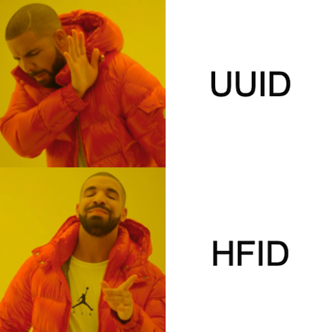

# Human-Friendly ID (HFID)

Generating Globally Unique Identifiers is a common use case. Generally, there are 2 ways to do:

1. **Use a Sequence Number Generator:** Very common to use when the objects created are stored in a relational database
   since most relational database provide this sequential id generation conveniently and out of the box. However, Using
   a sequential ids has several issues:
    1. It exposes sensitive business metrics - Just by signing up to a service and figuring out your user id, you can
       easily know the number of users in the system. This applies to other objects too like orders etc.
    2. No easy way to generate a sequential id when using a NoSQL databases.

2. **Use a UUID:** Is generally the way to go for id generation as the client can generate the id that is practically
   unlikely to have any collision with another id. The main issue here though is that the generated id is 128 bits that
   is represented using 36 character string that is rather jarring to the average users and makes it difficult to
   communicate in Apps and Websites neatly.

Enter HFID! human-friendly ids that are **guaranteed** to be unique and short.

## Basic concepts

1. **HFID:** a unique number that can be used to identify instances. The number is encoded into a string using a
   user-defined Encoding.
2. **Encoding:** a string that contains unique set of characters that can be used to encode HFIDs
3. **Generator:** Generates unique HFIDs. A generator is typically mapped 1:1 with a class or an object type like "
   User", "Order", etc. The generator has the following properties:
    1. **Name:** Mandatory and unique name for the id type.
    2. **Prefix:** a string to use as a prefix for all HFIDs that this generator generates. It is a recommended practice
       to use prefix. See why it is recommended [here](https://dev.to/stripe/designing-apis-for-humans-object-ids-3o5a).
    3. **Min Length** This is the minimum string length allowed for HFIDs.
    4. **Encoding:** The characters that are allowed to be used in the generated HFIDs. The default is digits and
       uppercase alphabets only (36 characters).
    5. **Length:** The HFID encoded string length to generate.

## How does it work?

The library heavily relies on a scalable KV store that supports a hyperloglog. The key would be the generator name and
the value would contain the generator attributes and a hyperloglog that tracks the HFIDs that have been generated so
far. The library allows you to pass the KV Store implementation that you prefer. Redis and Aerospike would work
perfectly for this use case.

## HFID Generation Algorithm

1. Fetch the attributes of the Generator from the KV store
2. Generate a random number in between ``(Number of Encoding Characters) ^ (Length - 1)``
   and ``(Number of Encoding Characters) ^ (Length)``
3. Add the generated number to the hyperloglog, then check
    1. If the hyperloglog didn't have this number before, then encode the generated number into a new HFID.
    2. Otherwise, repeat from step #1
4. Increment the ID Type length if the cardinality of the hyperloglog is high compared to the maximum number of HFIDs
   that can be generated at the current ID Type Length.

## How to use with Redis?
1. Add go dependency: `go get gitlab.com/alielgamal/hfid/redis`
2. Create the HFID generator to your liking: `g, err := hfid.NewGenerator("Example", "E-", hfid.DefaultEncoding, 1, 1)`
3. Create a GeneratorStore using the provided Redis implementation: `s := hfidredis.GeneratorStore{UniversalClient: uc}`
4. Generate HFID: `hfid.HFID(ctx, *g, s)`

See a working example using miniredis [here](redis/example/main.go)